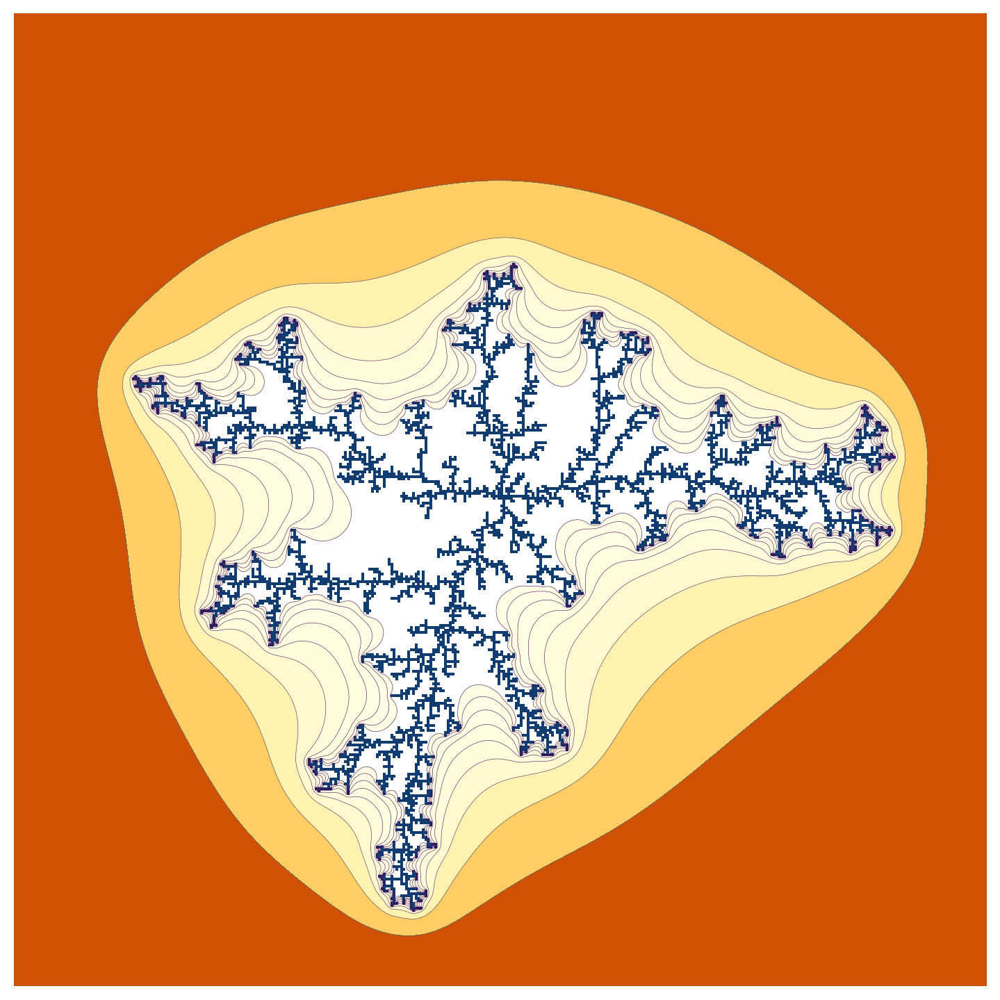

# Python_Simulations
Various Python Simulations

## Dielectric_Breakdown.ipynb
A simulation of the dielectric breakdown model described in:
_Fractal Dimension of Dielectric Breakdown, L. Niemeyer, L. Pietronero, ' and H. J. Wiesmann Brown Boveri Research Center, CH-5405 Baden, Switzerland_

